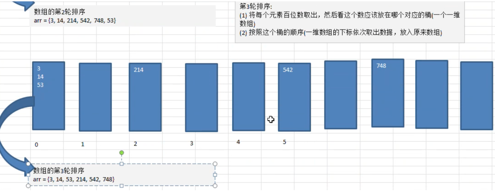

## 排序(Sort)  
#### 排序的分類  
1. 內部排序：將需要處理的所有數據，都加載到 **內存** 中進行排序  
2. 外部排序：因數據量過大，無法全部加載進內存，需藉助 **外部儲存(文件等)** 進行排序  
#### 冒泡排序(Bubble Sorting)  
1. 思路：**由前向後** 依次比較相鄰元素，發現逆序則交換，使得值較大的元素一直往後推  
2. 實現：[BubbleSort](BubbleSort.java)  
#### 選擇排序(Select Sorting)  
1. 思路：假定當前元素為最小值，開始向後比較，取最小值交換  
2. 實現：[SelectSort](SelectSort.java)  
#### 插入排序(Insertion Sorting)  
  
1. 思路：把n個待排序元素分為**有序表**和**無序表**，開始時有序表只有一個元素，之後從無序表中取出插入到有序表中  
2. 實現：[InsertionSort](InsertionSort.java)  
#### 希爾排序(Shell Sort)  
如果將小的數值要插入到最前面時，是慢慢將數往後移動一個位置，這樣太耗時了，所以希爾排序算法是對於上面插入排序法的優化版本。
1. 思路： 將n個數進行分組(增量分組)，每個組用插入排序法排序  
    1. 原數組：  
      
    2. 初始增量為`gap=length/2`為`gap=10/2=5`，數組被分為五組    
      
    3. 將上述分組每組進行插入排序法後，再增量分組`gap=5/2=2`  
      
    4. 最後`gap=2/2=1`，將一整組進行插入排序，基本上順序已經排得差不多，減少後面數往前調的機率。  
      
2. 實現：再進行插入時還有分交換法和移動法  
    * [SellSort](ShellSort.java)  
#### 快速排序(Quick Sort)  
  
1. 思路：將待排序數組分割成2個部分，一部份所有數據要比另一部份所有數據小，使用遞歸法再分割，最後完成排序。  
2. 實現：[QuickSort](QuickSort.java)  
#### 合併排序(Merge Sort)  
  
1. 思路：採用分治策略(Divide and Conquer)，先將問題分成小份，最後再將小份的答案合併到一起  
2. 實現：[MergeSort](MergeSort.java)  
#### 基數排序(Radix Sort)  
對於傳統桶排序(buckets sort)的擴展
1. 思路：  
    1. 第一輪：比較個位數，再按照桶的順序放回數組  
      
    2. 第二輪：第一輪的桶並未清理，沒有位數就放0  
      
    3. 第三輪：  
      
2. 實現：[RadixSort](RadixSort.java)  
#### 排序法比較  

    
    