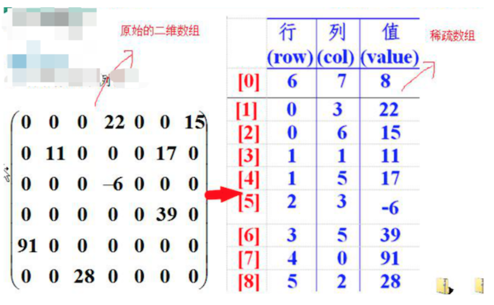

## 稀疏數組(Sparse Array)和隊列(Queue)  
#### 一、稀疏數組(Sparse Array)  
1. 實際需求
  
我們想要保存圖中2D-array的狀態，但array中太多不必要資訊(ex:0)，如果也把那些保存下來就太浪費資源了。  
2. 基本介紹  
定義：當數組中，大部分元素為0(或同一個值)，則可以用稀疏數組(sparse array)來保存。  
處理方法：  
    1. sparseArray[0] 紀錄數組有幾行(row)幾列(column)，有多少個值  
    2. 將不同元素值的 **行與列與值** 記錄在一個小規模的數組中，這小規模的數組就為*稀疏數組*  
      
3. 實現  
程式：[SparseArray](SparseArray.java)  
結果：  
    ```
    原始二維數組
    0 0 0 0 0 0 0 0 0 0 0 
    0 0 1 0 0 0 0 0 0 0 0 
    0 0 0 2 0 0 0 0 0 0 0 
    0 0 0 0 0 0 0 0 0 0 0 
    0 0 0 0 0 0 0 0 0 0 0 
    0 0 0 0 0 0 0 0 0 0 0 
    0 0 0 0 0 0 0 0 0 0 0 
    0 0 0 0 0 0 0 0 0 0 0 
    0 0 0 0 0 0 0 0 0 0 0 
    0 0 0 0 0 0 0 0 0 0 0 
    0 0 0 0 0 0 0 0 0 0 0 
   
    二維數組轉稀疏數組
    11 11 2 
    1 2 1 
    2 3 2 
   
    稀疏數組轉二維數組
    0 0 0 0 0 0 0 0 0 0 0 
    0 0 1 0 0 0 0 0 0 0 0 
    0 0 0 2 0 0 0 0 0 0 0 
    0 0 0 0 0 0 0 0 0 0 0 
    0 0 0 0 0 0 0 0 0 0 0 
    0 0 0 0 0 0 0 0 0 0 0 
    0 0 0 0 0 0 0 0 0 0 0 
    0 0 0 0 0 0 0 0 0 0 0 
    0 0 0 0 0 0 0 0 0 0 0 
    0 0 0 0 0 0 0 0 0 0 0 
    0 0 0 0 0 0 0 0 0 0 0
    ```  
#### 二、隊列(Queue)  
1. 基本介紹  
隊列：是一個 **有序列表**，可用數組(Array)或鏈表(Linked List)實現。  
特點：遵循 **先入先出** 原則。  
  
    * front:隊列頭部
    * rear:隊列尾部  
2. 實現  
    * 數組模擬：[ArrayQueue](ArrayQueue.java) (需改善)  
3. 問題分析  
上面實現的queue為一次性的，隊列加滿後就無法再添加數據，也無法清空隊列。  
優化方向：使用環形隊列。  
4. 環形隊列實現
    * [CircleQueue](CircleQueue.java)


