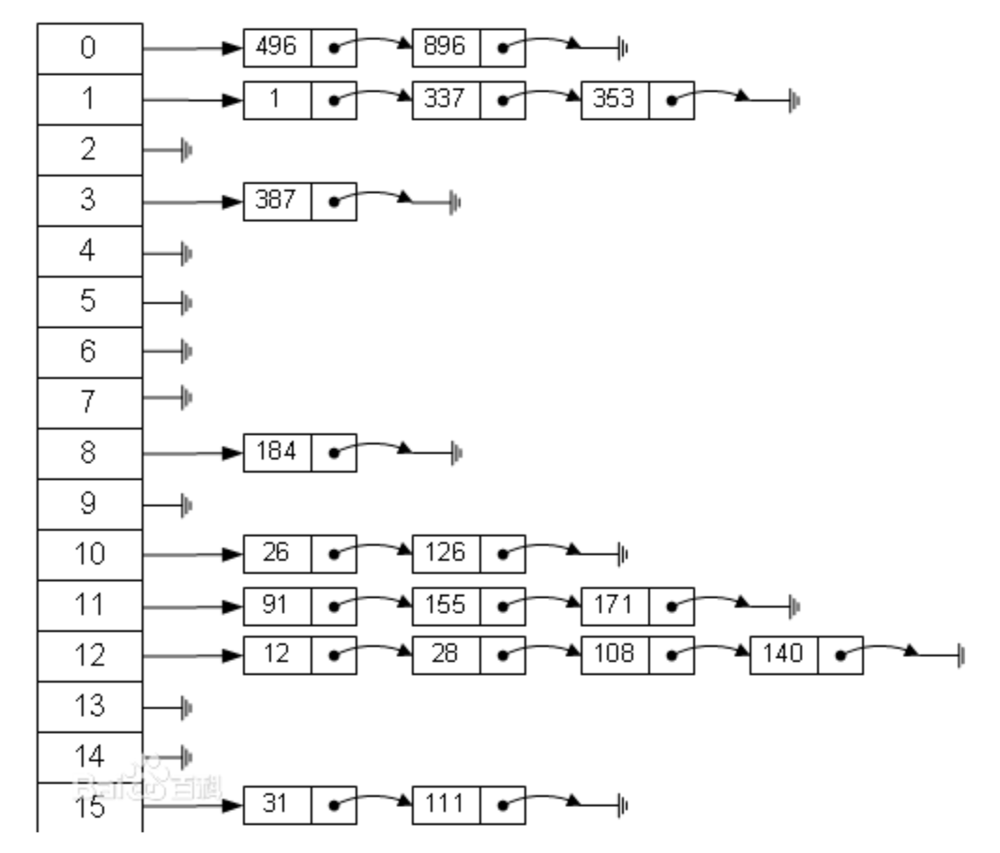

## 哈希表(Hash Table)  
1. 情景：有個員工到公司報到，要求儲存該員工的信息(id、性名、年齡...)，當輸入id時可以查到，不使用數據庫，盡量節省內存。這時就可以使用Hash Table。  
在早些年代，沒有緩存產品，就要自己寫緩存實現  
    * 數組＋鏈表  
    * 數組＋二叉樹  
  
    1. 左側16個元素的數組就是一個表  
    2. 用**散列函數**計算出一個位置，再把數據存到鏈表上  
2. 實現：按照上面情景，使用[HashTable](HashTable.java)實現  

