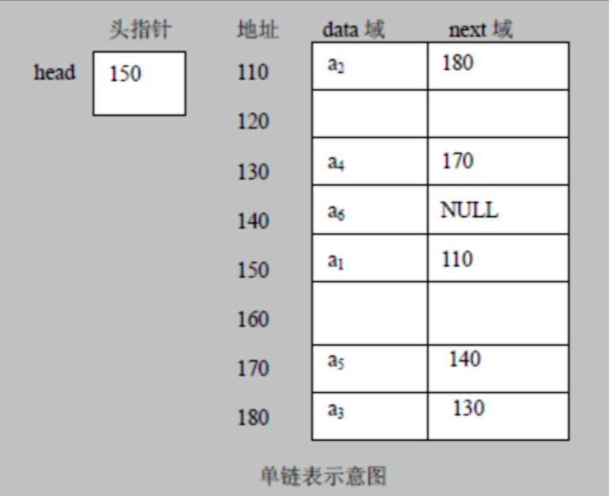
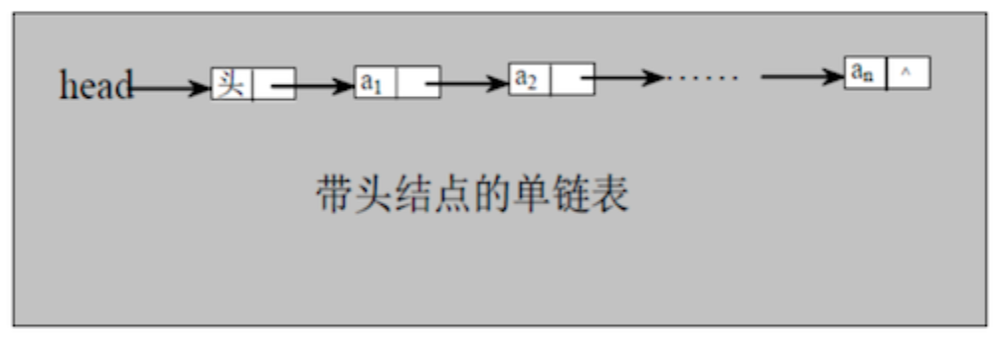
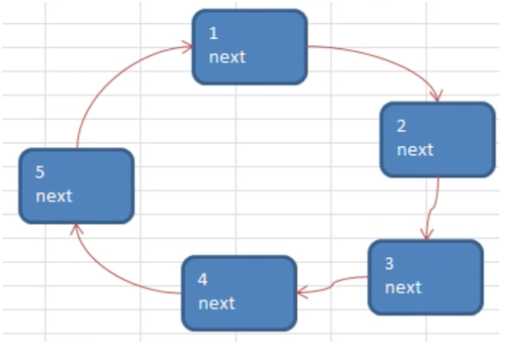

## 鏈表(Linked List)  

1. 鏈表是以節點方式儲存，鏈式儲存  
2. 每個節點包含data域、next域(指向下一個節點)  
3. 鏈表的各個節點 **不一定是連續的**  
4. 鏈表有分：帶頭節點、不帶頭節點  
#### 單鏈表(帶頭節點)  
  
1. 單鏈表應用實例  
有個場景：使用帶頭(head)的單向鏈表，實現傳說對決英雄排行  
    * 完成對英雄人物的 **增刪改查**  
    * 添加英雄時，可以選擇直接添加志尾部或根據排行添加  
2. 實現  
    * [SingleLinkedList](SingleLinkedList.java)  
#### 雙向鏈表  
1. 單向鏈表的缺點  
    * 查找元素時，只能單向進行  
    * 不能自我刪除節點，需找到上一節點才能完成刪除  
2. 雙向鏈表能雙向查找、能自我刪除節點  
3. 雙向鏈表修改處  
    * 每個節點新增`pre`去紀錄上個節點  
    * 查找方式可**向前**或**向後**  
    * 可自刪節點  
4. 實現  
    * [DoubleLinkedList](DoubleLinkedList.java)  
#### 單向環形鏈表 - Josephu問題  
1. 應用問題  
  
* `n=5` 有5個人  
* `k=1` 從第1個人開始數  
* `m=2` 數2次後出隊  
可得到隊列順序為：2 > 4 > 1 > 3 > 5  
2. 創建環形鏈表的思路  
    1. 當第一個節點加入時，使用`first`指向他，類似`head`作用，使用`curBoy`來輔助添加過程  
    2. 當第二個節點被加入時，其中`next`要指向`first`，以此類推  
3. 實現  
    * [CircleSingleLinkedList](CircleSingleLinkedList.java)  
