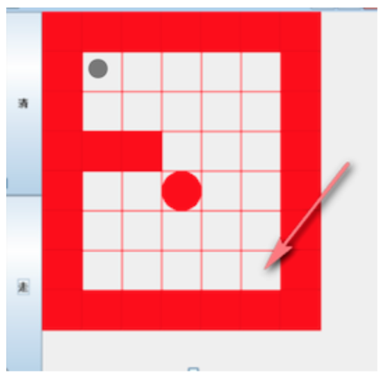

## 遞歸(Recursion)  
#### 基本知識  
1. 執行方法時，會在記憶體中創建屬於那個方法的空間(棧空間)  
2. 方法的局部變量是獨立的不會互相影響，但如果是引用類型(ex:Array)，會共享該引用類型的數據  
3. 需設置 **退出遞歸的條件**，不然會無限遞歸，出現`StackOverFlowError`  
#### 迷宮問題  
  
1. 紅色方塊是圍牆  
2. 白色方塊為可活動區域  
3. 左上是小球，走到右下算過關  
4. 路徑策略：下->右->上->左  
5. 實現：[Maze](Maze.java)  
    ```
   ---原地圖---
   1 1 1 1 1 1 1 
   1 0 0 0 0 0 1 
   1 0 0 0 0 0 1 
   1 1 1 0 0 0 1 
   1 0 0 0 0 0 1 
   1 0 0 0 0 0 1 
   1 0 0 0 0 0 1 
   1 1 1 1 1 1 1 
   ---探索後---
   1 1 1 1 1 1 1 
   1 2 3 3 3 3 1 
   1 2 2 2 3 3 1 
   1 1 1 2 3 3 1 
   1 2 2 2 3 3 1 
   1 0 2 2 3 3 1 
   1 0 2 2 3 3 1 
   1 1 1 1 1 1 1
   ```  
   * `3`代表此路不通，路線會到死胡同  
   * 起點設置(1,1) 終點為(4,1)  
#### 八皇后問題(回朔法)  
在8x8的西洋棋盤中，擺放八個皇后，使其不能互相攻擊。也就是說任兩個皇后不能處於同行、同列、同斜線。這樣會有多少種排法？  
1. 思路：
    1. 第一個皇后先擺第一行第一列  
    2. 第二個擺第二行第一列，看有無違反規則，有的話繼續嘗試第二列  
    3. 嘗試到擺滿8個，會回朔上一個棧嘗試，最後將得到第一個皇后的位置的所有解  
    4. 繼續嘗試第一個皇后擺在第一行第二列，然後重複上面步驟  
2. 實現：[Queen8](Queen8.java)  

    