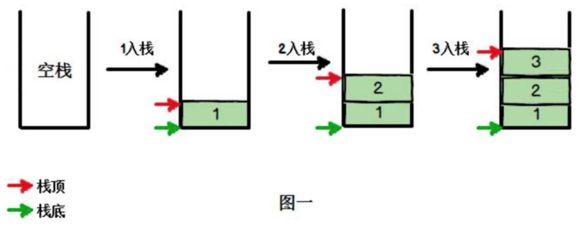
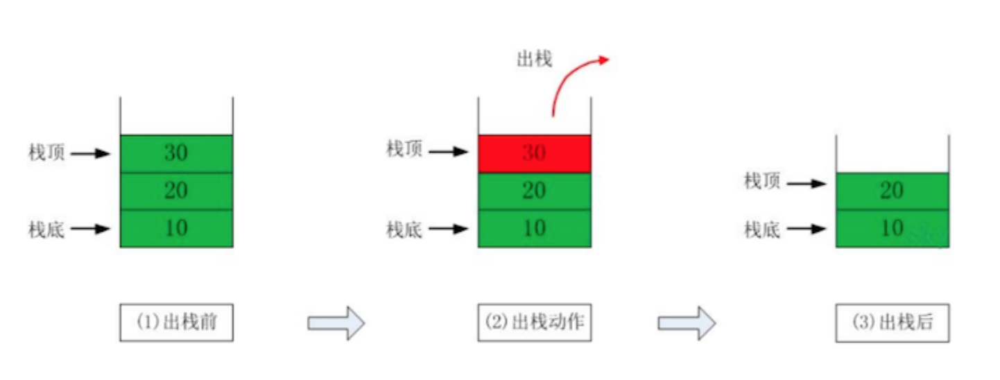

## 棧(Stack)  
  
1. 是一個 **先入後出(LIFO)** 的有序列表  
2. 元素的插入和刪除只能在 **同一端** 進行的特殊線性表  
    * 棧頂(Top):允許插入和刪除的一端，為可變化的一端  
    * 棧底(Bottom):為固定的一端  
  
#### 棧的應用場景  
1. 在子程序的調用前，會先將主程序中的 **下一個指令地址** 先存入棧中，直到子程序結束後再將地址取出，回到原本的主程序中。  
2. 處理遞歸調用  
3. 表達式轉換  
4. 二叉樹的遍歷  
5. 圖形的DFS  
#### 用數組模擬棧  
* 定義一個數組(array)來模擬棧  
* `top`表示棧頂  
*  實現：  
    * 數組實現：[ArrayStack](ArrayStack.java)  
    * 單向鏈表實現：[LinkedListStack](LinkedListStack.java)  
#### 綜合計算器(中綴表達式)  
使用棧來實現綜合計算器表達式的結果，例如：`30+2*6-2`= ?  
1. 思路： 
    1. 掃描字符串  
    2. 如果是數字，`numStack`入棧  
    3. 如果是操作符，分情況：  
        1. 當前操作符優先級小於或等於`operStack`棧頂，則要pop出`numStack`的2個元素和`operStack`的一個元素，做完計算後將結果壓回`numStack`，當前操作符壓入`operStack`  
        2. 當前操作符優先級大於`operStack`棧頂，則直接壓入`operStack`  
    4. 掃描完畢後，依序`numStack`pop出2個，`operStack`pop出一個，然後將結果壓回`numStack`  
    5. 最後結果會在`numStack`  
2. 實現：[Calculator](Calculator.java)  
#### Polish notation(前綴表達式)  
中綴：`(3+4)x5-6` 前綴：`- x + 3 4 5 6`  
1. 思路：
    1. 從 **右至左** 掃描  
    2. 遇數字壓入`numStack`  
    3. 遇到運算符時，`numStack`pop出2個，運算後將結果壓回`numStack`  
    4. 前綴表達式的優先級已經處理好了，所以不用額外判斷  
#### Reverse Polish notation(後綴表達式)
中綴：`(3+4)x5-6`  後綴：`3 4 + 5 x 6 -`  
1. 思路：
    1. 從 **左至右** 掃描  
    2. 遇數字壓入`numStack`  
    3. 遇到運算符時，`numStack`pop出2個，運算後將結果壓回`numStack`  
2. 實現：[ReversePolishCalculator](ReversePolishCalculator.java)  

    
     
    