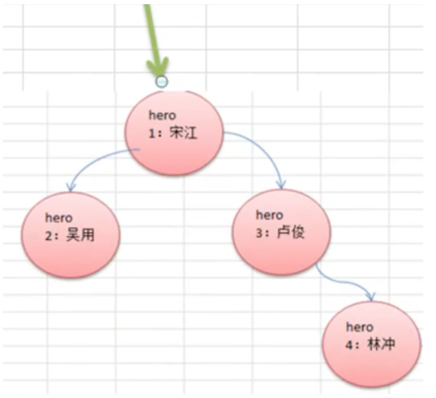
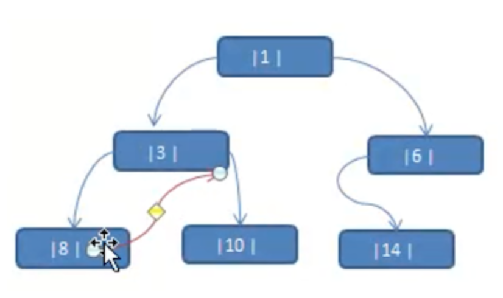
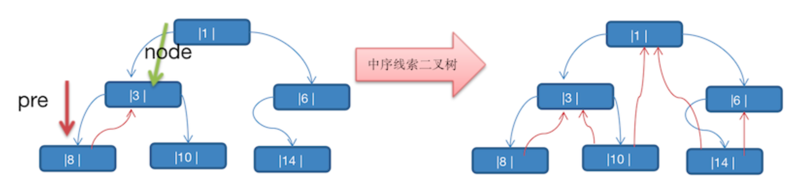
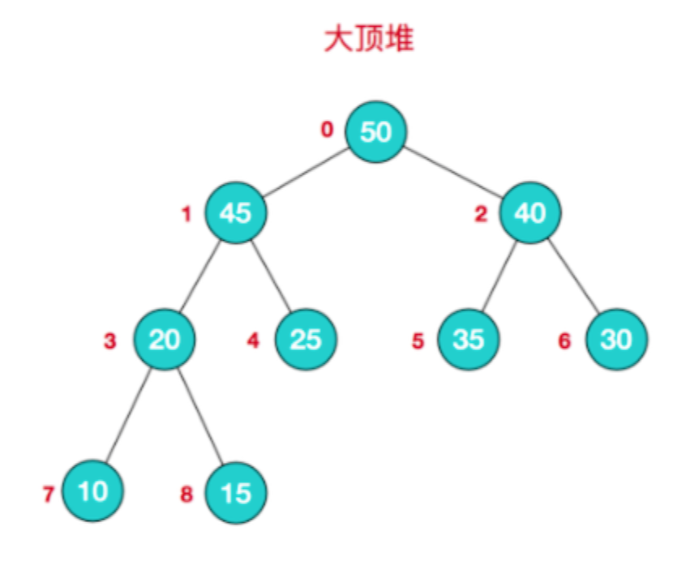
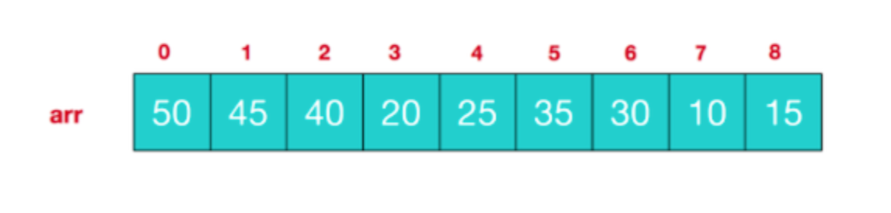
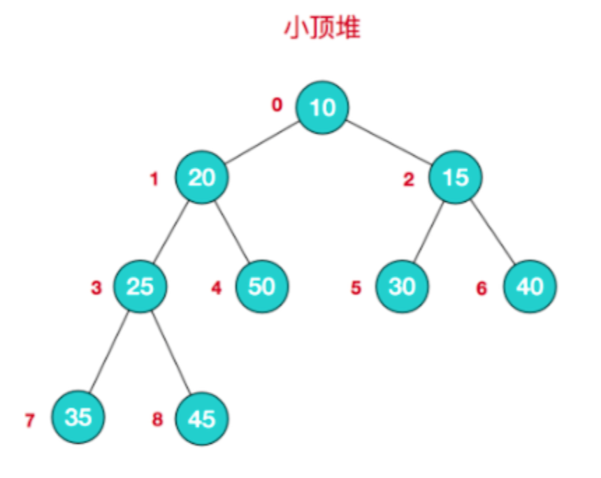
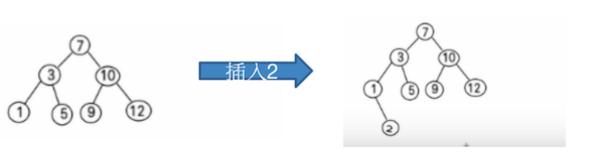
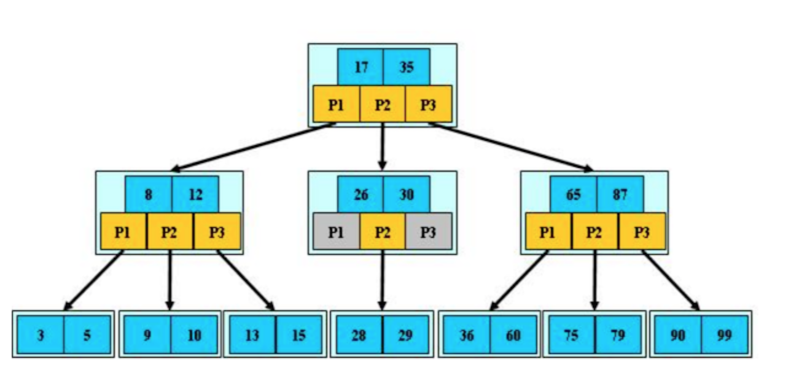
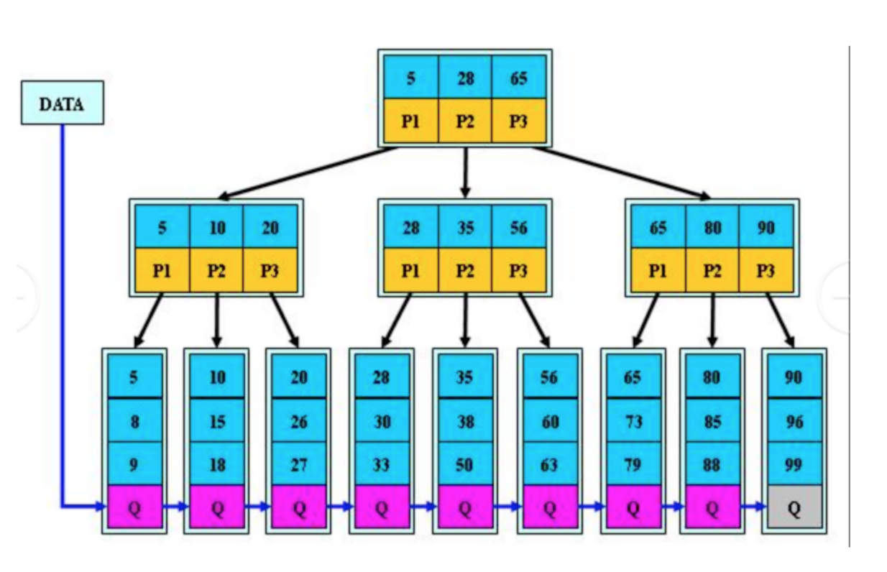

## 樹(Tree)  
#### 二叉樹(Binary Tree)  
1. 遍歷二叉樹  
  
    * 前序遍歷(Pre-order Traversal):  
        1. 先輸出當前節點  
        2. 如左節點不為空，則遞歸進入  
        3. 如右節點不為空，則遞歸進入  
        *  輸出順序：[1,2,3,4]  
    * 中序遍歷(In-order Traversal):  
        1. 如當前節點的左節點不為空，則遞歸進入  
        2. 輸出當前節點
        3. 如當前節點的右節點不為空，則遞歸進入  
        *  輸出順序：[2,1,3,4]  
    * 後序遍歷(Post-order Traversal):  
        1. 如左節點不為空，則遞歸進入
        2. 如右節點不為空，則遞歸進入  
        3. 輸出當前節點  
        *  輸出順序：[2,4,3,1]  
2. 實現：[BinaryTree](BinaryTree.java)  
#### 順序存儲二叉樹  
1. 概念：**數組儲存**方式和**樹儲存**方式可以互相轉換  
  
2. 要求：  
    1. 將上圖二叉樹轉成數組儲存：[1,2,3,4,5,6,7]  
    2. 遍歷數組時，還是可以用前、中、後序遍歷  
3. 特點：  
    1. 順序二叉樹，通常只考慮完全二叉樹  
    2. 第`n`個元素的左子節點為`2*n+1`  
    3. 第`n`個元素的右子節點為`2*n+2`  
    4. 第`n`個元素的父節點為`(n-1)/2`  
4. 實現：[ArrBinaryTree](ArrBinaryTree.java)  
#### 線索化二叉樹(Threaded Binary Tree)  

1. 介紹：如上圖，中序遍歷為`8,3,10,1,14,6`，8的後繼節點為3，3的後繼節點為10，根據線索性質不同，線索二叉樹可分：前、中、後序線索二叉樹。  
2. 思路：  
  
    * 8的後繼節點是3  
    * 3由於左右節點都有元素，不能線索化  
    * 10的前驅節點為3，後繼節點為1  
    * 1不能線索化  
    * 14的前驅節點為1，後繼節點為6  
    * 6有左節點，不能線索化  
注意：10的left是前驅節點，right是後繼節點  
3. 實現：[ThreadedBinaryTree](ThreadedBinaryTree.java)  
#### 堆(Heap)  
基本介紹  
* 大頂堆(Max-Heap):每個節點都 **大於或等於** 左右子節點  
  

* 小頂堆(Min-Heap):每個節點都 **小於或等於** 左右子節點  
  
#### 二叉排序樹(Binary Search Tree)  
1. 介紹  
又稱 **BST**，左節點小於父節點，右節點大於父節點  
  
2. 問題  
當節點樹過多時，會出現下列問題：  
    1. 建構時，需多次I/O操作  
    2. 二叉樹高度太高，降低操作速度  
#### B樹  
B 樹通過重新組織節點，降低樹的高度，並且减少 I/O 讀寫次數来提升效率，MySQL中的索引多使用此結構。  
B樹：  
  
B+樹：  

    
    

        